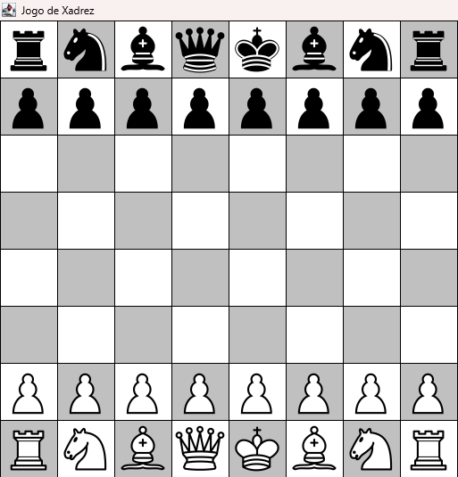

# Projeto Xadrez

> Este é um jogo de xadrez completo e funcional feito em Java com a biblioteca Swing, desenvolvido como um desafio prático para aplicar e aprofundar conceitos de Orientação a Objetos. O foco foi criar um motor de jogo preciso, que gerencia todas as regras clássicas e permite que dois jogadores disputem uma partida localmente.

